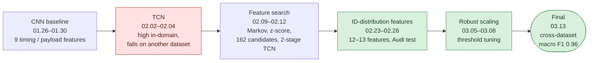
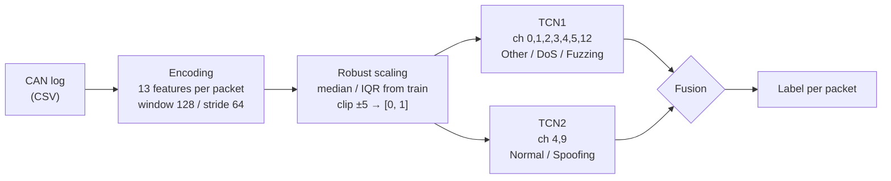

# Robust-Scaling and Dual-TCN Based CAN Intrusion Detection System for Cross-Vehicle Generalization

**English** | [한국어](README_ko.md)

A three-person research project, presented as an oral-session paper at the 2026 KSAE Spring Conference, on a deep-learning intrusion detection system (IDS) for in-vehicle CAN networks that keeps working on a dataset it was not trained on

| | |
|---|---|
| Paper | 교차 차량 일반화를 위한 Robust-Scaling 및 Dual-TCN 기반 CAN 침입 탐지 시스템<br/>*(Robust-Scaling and Dual-TCN Based CAN Intrusion Detection System for Cross-Vehicle Generalization)* |
| Venue | 2026 KSAE (Korean Society of Automotive Engineers) Spring Conference · oral session paper |
| Topic | Packet-level CAN attack detection (Normal / DoS / Fuzzing / Spoofing) with cross-dataset generalization |
| Period | 2026.01 – 2026.03 |
| Team | Sihyeon Park, Yoonju Jeong, Jaeho Shin |
| Stack | Python · PyTorch · NumPy / pandas · Numba · scikit-learn · Jupyter |
| Result | **Trained on Car Hacking Challenge 2021, tested on the Car-Hacking Dataset: accuracy 0.9793 · macro F1 0.9605** |

## The Story in One Picture



- **Goal**: detect attacks without depending on one vehicle's CAN IDs or payload patterns, so the model still works on another vehicle's data
- **What held us back**: models on timing and payload statistics reached macro F1 0.81–0.89 on a split of the training data but 0.31–0.50 on the Car-Hacking Dataset; Normal and Spoofing collapsed
- **What turned it around**: features describing the CAN ID distribution inside a window (ID 0x000 flag, local frequency, ID entropy, top-1 share, dominance), a 2-stage TCN that handles Spoofing separately, and robust scaling fitted on training data only

## Result

Train: Car Hacking Challenge 2021 (`0_Preliminary/1_Submission`) · test: Car-Hacking Dataset (different vehicle, different recording)

| Class | Precision | Recall | F1 |
|---|---|---|---|
| Normal | 0.9915 | 0.9843 | 0.9879 |
| DoS | 1.0000 | 1.0000 | 1.0000 |
| Fuzzing | 0.9989 | 0.9547 | 0.9763 |
| Spoofing | 0.8382 | 0.9215 | 0.8779 |
| **Overall** | | | **accuracy 0.9793 · macro F1 0.9605 · weighted F1 0.9797** |

Replay is not in the Car-Hacking Dataset and has no output class in the final model.

## System



| Part | What it does |
|---|---|
| Encoding | 13 features per packet: ID 0x000 flag, DLC, payload change, entropy × change, local frequency, ID entropy, streak ratio, window-normalised count, frequency vs. top-1 ID, top-1 share, index-gap CV, dominance, same-ID payload surprise |
| Scaling | Per-channel `(x − median) / IQR` from training data, clip to ±5, map to [0, 1] |
| TCN | Causal TCN, channels [32, 64, 128], dilation [1, 2, 4], kernel 3, residual blocks, 1×1 classifier per packet |
| Fusion | DoS if p(DoS) ≥ 0.9, Fuzzing if p(Fuzzing) ≥ 0.1 (larger logit if both), otherwise TCN2 decides Normal vs Spoofing |

## Team

|  |  |  |
|:---:|:---:|:---:|
| **Sihyeon Park**<br/>[@kha-2](https://github.com/kha-2) | **Yoonju Jeong**<br/>[@yoonju04](https://github.com/yoonju04) | **Jaeho Shin**<br/>[@greendino-04](https://github.com/greendino-04) |

## Key Problems

| Problem | Cause | What we did |
|---|---|---|
| High validation score, low score on another dataset | Timing and payload statistics are specific to one vehicle | Moved to CAN-ID-distribution features and tested on a different dataset |
| Spoofing missed by a single model | Spoofing looks like Normal in most channels | Separate Normal-vs-Spoofing TCN on its own channels (single TCN: 11.8% Spoofing accuracy) |
| Over-optimistic numbers | Random split of overlapping windows, oversampling before the split, testing on training-source data | Kept the cross-dataset test as the main measure |
| Feature distributions shift between datasets | Raw scales differ by vehicle | Robust scaling with statistics from training data only |
| Replay not detected | Replay was masked out of the loss from the early TCN runs; the 2-stage model has no Replay output | Left as future work |

## Post-mortem

Most of the gain came from changing *what* the model sees: TCN models went from macro F1 0.31–0.50 to 0.96 on the Car-Hacking Dataset once the features described the CAN ID distribution instead of per-vehicle timing, with the 2-stage split fixing Spoofing. Permutation tests on the final model show DoS depends almost entirely on the ID 0x000 flag, which is worth checking on a third dataset.

Full analysis and lessons: [docs/postmortem.md](docs/postmortem.md)

## Quick Start

```bash
pip install -r requirements.txt
```

Run the notebooks in this order (paths inside are hard-coded to the original machine, `C:/Users/user/Desktop/IDS_masters/...`):

1. `encoding/car_challenge_encoding.ipynb` → `carchallenge_training_0313.npz`
2. `encoding/carhacking_encoding.ipynb` → `carhacking_0313.npz`
3. `scaling/robust_scaling.ipynb` → `carchallenge_robust_0313.npz`, `carhacking_robust_0313.npz`
4. `model/Multi_TCN.ipynb` → `TCN1_0313_all.pth`, `TCN2_0313_all.pth` and the result table

Exact final code as uploaded: `git checkout final-2026-03-13` (`0313/REAL/`)

## Repository

- `encoding/`: final feature encoding
- `scaling/`: final robust scaling
- `model/`: final 2-stage TCN and weights
- `experiments/`: every earlier experiment, by date
- `data/`: MIRGU window tables from the first experiments

## Docs

- [docs/postmortem.md](docs/postmortem.md): why cross-dataset failed and what fixed it, evaluation pitfalls, lessons
- [docs/timeline.md](docs/timeline.md): experiments by date with their numbers
- [docs/repository.md](docs/repository.md): folder tree, branches and tags, datasets
