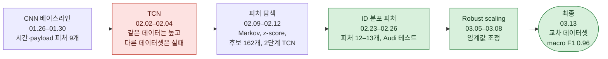
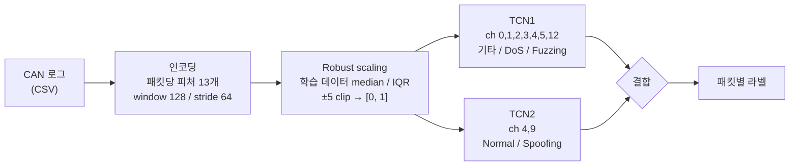

# 교차 차량 일반화를 위한 Robust-Scaling 및 Dual-TCN 기반 CAN 침입 탐지 시스템

[English](README.md) | **한국어**

차량 내부 CAN 네트워크 공격을 탐지하는 딥러닝 IDS를, 학습에 쓰지 않은 데이터셋에서도 동작하도록 만든 3인 연구 프로젝트 (2026 한국자동차공학회 춘계학술대회 구두 발표 논문)

| | |
|---|---|
| 논문 | 교차 차량 일반화를 위한 Robust-Scaling 및 Dual-TCN 기반 CAN 침입 탐지 시스템 |
| 발표 | 2026 한국자동차공학회(KSAE) 춘계학술대회 · 구두 발표(oral session) 논문 |
| 주제 | 패킷 단위 CAN 공격 탐지(Normal / DoS / Fuzzing / Spoofing)와 교차 데이터셋 일반화 |
| 기간 | 2026.01 – 2026.03 |
| 팀 | 박시현, 정윤주, 신재호 |
| 스택 | Python · PyTorch · NumPy / pandas · Numba · scikit-learn · Jupyter |
| 결과 | **Car Hacking Challenge 2021로 학습, Car-Hacking Dataset으로 테스트: accuracy 0.9793 · macro F1 0.9605** |

## 한눈에 보는 흐름



- **목표**: 특정 차량의 CAN ID나 payload 패턴에 의존하지 않고 공격을 탐지해, 다른 차량 데이터에서도 동작하게 만들기
- **막혔던 점**: 시간·payload 통계 피처 모델은 학습 데이터를 나눈 검증셋에서 macro F1 0.81–0.89였지만, Car-Hacking Dataset에서는 0.31–0.50으로 떨어졌고 Normal과 Spoofing이 무너졌음
- **돌파구**: 윈도우 안의 CAN ID 분포를 나타내는 피처(ID 0x000 여부, 국소 빈도, ID 엔트로피, top-1 비율, 지배도), Spoofing을 따로 판정하는 2단계 TCN, 학습 데이터 통계만 쓰는 robust scaling

## 결과

학습: Car Hacking Challenge 2021 (`0_Preliminary/1_Submission`) · 테스트: Car-Hacking Dataset (다른 차량, 다른 수집)

| 클래스 | Precision | Recall | F1 |
|---|---|---|---|
| Normal | 0.9915 | 0.9843 | 0.9879 |
| DoS | 1.0000 | 1.0000 | 1.0000 |
| Fuzzing | 0.9989 | 0.9547 | 0.9763 |
| Spoofing | 0.8382 | 0.9215 | 0.8779 |
| **전체** | | | **accuracy 0.9793 · macro F1 0.9605 · weighted F1 0.9797** |

Replay는 Car-Hacking Dataset에 없고, 최종 모델에도 Replay 출력 클래스가 없습니다.

## 시스템



| 구성 | 역할 |
|---|---|
| 인코딩 | 패킷당 피처 13개: ID 0x000 여부, DLC, payload 변화량, 엔트로피×변화량, 국소 빈도, ID 엔트로피, 연속 비율, 윈도우 평균 대비 빈도, top-1 ID 대비 빈도, top-1 비율, 인덱스 간격 CV, 지배도, 같은 ID payload surprise |
| 스케일링 | 학습 데이터의 채널별 `(x − median) / IQR`, ±5로 clip, [0, 1]로 변환 |
| TCN | Causal TCN, 채널 [32, 64, 128], dilation [1, 2, 4], kernel 3, residual 블록, 패킷별 1×1 분류기 |
| 결합 | p(DoS) ≥ 0.9면 DoS, p(Fuzzing) ≥ 0.1이면 Fuzzing(둘 다면 logit이 큰 쪽), 나머지는 TCN2가 Normal/Spoofing 판정 |

## 팀

|  |  |  |
|:---:|:---:|:---:|
| **박시현**<br/>[@kha-2](https://github.com/kha-2) | **정윤주**<br/>[@yoonju04](https://github.com/yoonju04) | **신재호**<br/>[@greendino-04](https://github.com/greendino-04) |

## 주요 문제

| 문제 | 원인 | 대응 |
|---|---|---|
| 검증 점수는 높은데 다른 데이터셋에서 낮음 | 시간·payload 통계가 특정 차량에 묶여 있음 | CAN ID 분포 피처로 바꾸고 다른 데이터셋으로 테스트 |
| 단일 모델이 Spoofing을 놓침 | Spoofing은 대부분의 채널에서 Normal과 비슷함 | 별도 채널을 쓰는 Normal/Spoofing 전용 TCN (단일 TCN은 Spoofing 정확도 11.8%) |
| 지나치게 좋은 수치 | 겹치는 윈도우의 무작위 split, split 전 오버샘플링, 학습과 같은 출처로 테스트 | 교차 데이터셋 테스트를 주 지표로 사용 |
| 데이터셋 간 피처 분포 차이 | 차량마다 원래 스케일이 다름 | 학습 데이터 통계만 쓰는 robust scaling |
| Replay 미탐지 | 초기 TCN부터 Replay를 loss에서 제외했고, 2단계 모델에 Replay 출력이 없음 | 향후 과제 |

## 회고

성능 향상 대부분은 모델이 *무엇을 보는지*를 바꾼 데서 나왔습니다. 피처를 차량별 타이밍 대신 CAN ID 분포로 바꾸자 TCN 모델의 Car-Hacking Dataset macro F1이 0.31–0.50에서 0.96으로 올랐고, 2단계 분리로 Spoofing이 해결됐습니다. 최종 모델의 permutation 테스트에서 DoS는 거의 ID 0x000 피처 하나에 의존해서, 세 번째 데이터셋으로 확인해 볼 필요가 있습니다.

자세한 분석과 교훈: [docs/postmortem_ko.md](docs/postmortem_ko.md)

## 실행 방법

```bash
pip install -r requirements.txt
```

아래 순서로 노트북을 실행합니다. 노트북 안의 경로는 원래 PC 기준(`C:/Users/user/Desktop/IDS_masters/...`)으로 하드코딩되어 있습니다.

1. `encoding/car_challenge_encoding.ipynb` → `carchallenge_training_0313.npz`
2. `encoding/carhacking_encoding.ipynb` → `carhacking_0313.npz`
3. `scaling/robust_scaling.ipynb` → `carchallenge_robust_0313.npz`, `carhacking_robust_0313.npz`
4. `model/Multi_TCN.ipynb` → `TCN1_0313_all.pth`, `TCN2_0313_all.pth`, 결과 표

업로드 당시 최종 코드 그대로 보기: `git checkout final-2026-03-13` (`0313/REAL/`)

## 레포 구성

- `encoding/`: 최종 피처 인코딩
- `scaling/`: 최종 robust scaling
- `model/`: 최종 2단계 TCN과 가중치
- `experiments/`: 날짜별 이전 실험 전부
- `data/`: 초기 실험의 MIRGU 윈도우 테이블

## 문서

- [docs/postmortem_ko.md](docs/postmortem_ko.md): 교차 데이터셋 실패 원인과 해결, 평가 함정, 교훈
- [docs/timeline_ko.md](docs/timeline_ko.md): 날짜별 실험과 수치
- [docs/repository_ko.md](docs/repository_ko.md): 폴더 구조, 브랜치와 태그, 데이터셋
