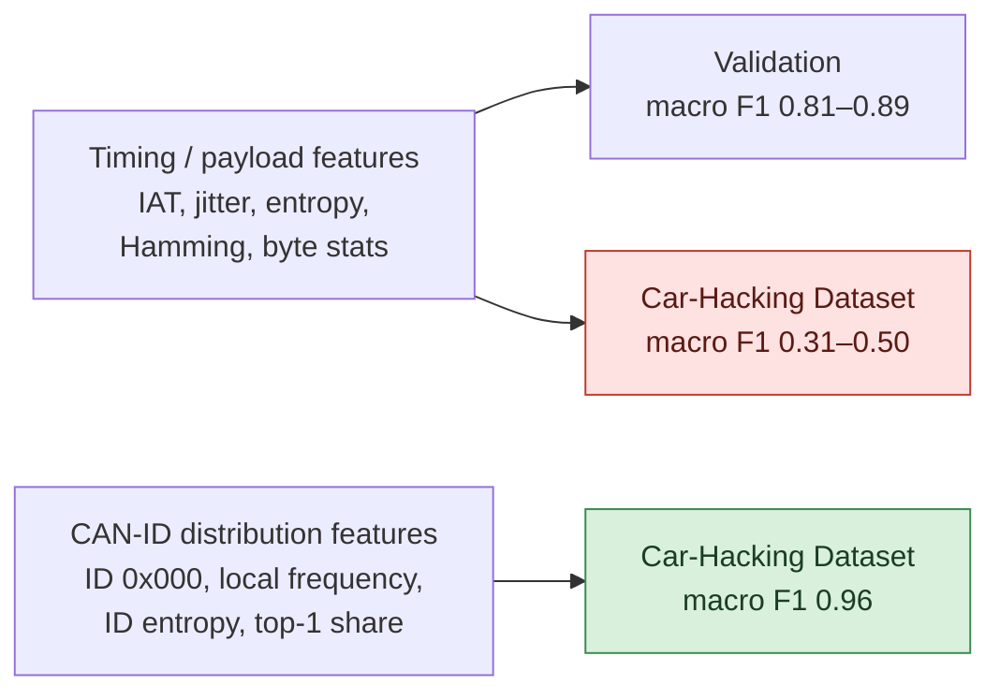

# Post-mortem

[← README](../README.md) · **English** | [한국어](postmortem_ko.md)

## Summary

The final model detects DoS, Fuzzing and Spoofing on a dataset it never saw during training (macro F1 0.9605). For the first month the opposite was true: every model scored well on a split of its own training data and failed on the Car-Hacking Dataset. The turning point was the feature set, not the network.

## 1. Why Cross-Dataset Failed

| Observation | Evidence |
|---|---|
| Timing and payload statistics differ between vehicles | Same models: validation macro F1 0.81–0.89, cross-dataset 0.31–0.50 (01.29–02.04) |
| Normal traffic was the first to break | Cross-dataset Normal accuracy 23.7% (02.02), 42.8% (02.04), 33.4% (02.23): the model flagged unfamiliar normal traffic as attacks |
| Attacks change the *mix* of IDs in a window | DoS floods ID 0x000, Fuzzing adds random IDs, Spoofing raises one ID's share; these are visible regardless of the vehicle |

## 2. Why Two Stages

A single 5-class model kept trading Spoofing against Normal. Splitting the decision fixed it:

- **TCN1** sees 7 channels and separates DoS and Fuzzing from everything else.
- **TCN2** sees only local frequency and top-1 share, and is trained only on Normal and Spoofing packets.

On the Car-Hacking Dataset, a single TCN reached 11.8% Spoofing accuracy (recall); the 2-stage model reached recall 0.92 and F1 0.88.

## 3. What the Final Model Relies On

Permutation test on the Car-Hacking Dataset (shuffle one channel, measure the drop):

| Attack | Baseline F1 | Most important channel | F1 after shuffling |
|---|---|---|---|
| DoS | 1.00 | ch 0, ID 0x000 flag | 0.05 |
| Fuzzing | 0.97 | ch 12, same-ID surprise | 0.05 |
| Fuzzing | 0.97 | ch 5, ID entropy | 0.14 |
| Spoofing | 0.88 | ch 4, local frequency | 0.09 |

DoS depends on a single flag. DoS in both datasets appears as ID 0x000 traffic, so this works here, but a DoS with another ID would not be caught. Channels 1 (DLC) and 3 (entropy × change) barely matter and could be removed.

## 4. Evaluation Pitfalls We Hit

| Pitfall | Where | Effect |
|---|---|---|
| Random split of overlapping windows | Most notebooks (stride = half window) | Neighbouring windows land in train and validation; validation is optimistic |
| Oversampling before the split | 01.30 encoding | Copies of the same window in train and validation |
| Testing on training-source data | 02.12 "Spoofing 97%" | On a held-out set from the same challenge, Spoofing was 3.7% |
| float32 confusion matrix | 01.30 `evaluate.ipynb` | Counts saturate at 2²⁴; Normal accuracy wrong |
| Accuracy above 1 | 02.02–02.03 TCN notebooks | Packets divided by windows |
| Stale outputs | Several notebooks | Saved output from an older version of the code |

What worked: keeping a different dataset as the test set and reporting per-class P/R/F1.

## 5. Open Issues

- **Replay** has no output class. It was masked from the loss early and never added back.
- **Oversampling** is called in the final notebook, but the training loader uses the original split.
- **`FEATURE_NAMES`** in the encoding notebooks still lists old names.
- **Paths** are hard-coded to the original machine.
- **One cross-dataset test**: Car-Hacking is the only unseen dataset in the final run; Audi was tested with an earlier feature set (macro F1 0.91).

## 6. Lessons

1. Test on a different dataset from the first week; in-domain validation hid the real problem for a month.
2. Change the input representation before the architecture.
3. Split by recording or time, not by random windows, when windows overlap.
4. Keep one notebook per stage and import shared code; the same model and training loop were copied into many notebooks and drifted apart.
5. Name versions by content, not "final", "real final", "(1) (1)".
