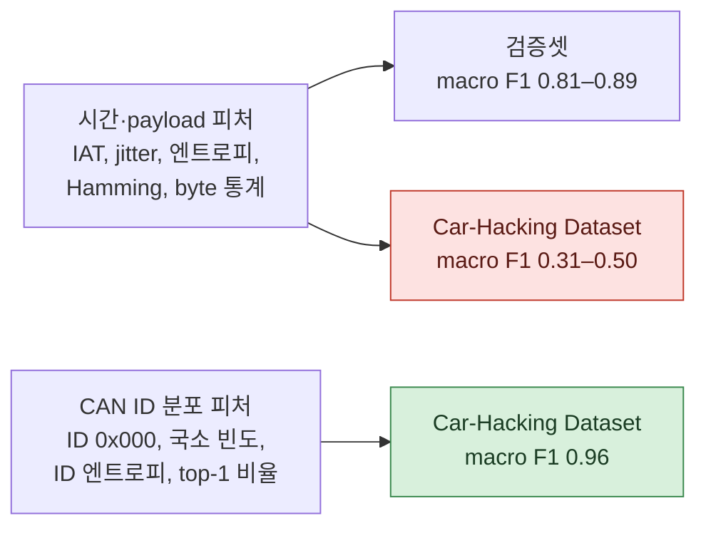

# 회고

[← README](../README_ko.md) · [English](postmortem.md) | **한국어**

## 요약

최종 모델은 학습에 쓰지 않은 데이터셋에서 DoS, Fuzzing, Spoofing을 탐지합니다(macro F1 0.9605). 첫 한 달은 반대였습니다. 모든 모델이 학습 데이터를 나눈 검증셋에서는 점수가 좋았지만 Car-Hacking Dataset에서는 실패했습니다. 전환점은 네트워크가 아니라 피처였습니다.

## 1. 교차 데이터셋에서 실패한 이유

| 관찰 | 근거 |
|---|---|
| 시간·payload 통계는 차량마다 다름 | 같은 모델이 검증 macro F1 0.81–0.89, 교차 0.31–0.50 (01.29–02.04) |
| 가장 먼저 무너진 건 Normal | 교차 Normal 정확도 23.7% (02.02), 42.8% (02.04), 33.4% (02.23): 낯선 정상 트래픽을 공격으로 판정 |
| 공격은 윈도우 안 ID *구성*을 바꿈 | DoS는 ID 0x000을 쏟아내고, Fuzzing은 무작위 ID를 섞고, Spoofing은 특정 ID 비율을 높임. 차량과 관계없이 보이는 특징 |

## 2. 2단계로 나눈 이유

5클래스 단일 모델은 Spoofing과 Normal을 서로 맞바꾸기만 했습니다. 판정을 나누자 해결됐습니다.

- **TCN1**은 7채널을 보고 DoS·Fuzzing을 나머지와 구분합니다.
- **TCN2**는 국소 빈도와 top-1 비율만 보고, Normal·Spoofing 패킷으로만 학습합니다.

Car-Hacking Dataset에서 단일 TCN은 Spoofing 정확도(recall) 11.8%, 2단계 모델은 recall 0.92, F1 0.88이었습니다.

## 3. 최종 모델이 의존하는 피처

Car-Hacking Dataset에서 permutation 테스트(채널 하나를 섞고 성능 하락 측정):

| 공격 | 기준 F1 | 가장 중요한 채널 | 섞은 뒤 F1 |
|---|---|---|---|
| DoS | 1.00 | ch 0, ID 0x000 여부 | 0.05 |
| Fuzzing | 0.97 | ch 12, 같은 ID surprise | 0.05 |
| Fuzzing | 0.97 | ch 5, ID 엔트로피 | 0.14 |
| Spoofing | 0.88 | ch 4, 국소 빈도 | 0.09 |

DoS는 피처 하나에 의존합니다. 두 데이터셋 모두 DoS가 ID 0x000 트래픽으로 나타나서 여기서는 통하지만, 다른 ID로 하는 DoS는 놓칠 수 있습니다. 채널 1(DLC)과 3(엔트로피×변화량)은 거의 영향이 없어 빼도 됩니다.

## 4. 겪은 평가 함정

| 함정 | 위치 | 영향 |
|---|---|---|
| 겹치는 윈도우의 무작위 split | 대부분의 노트북 (stride = 윈도우 절반) | 이웃 윈도우가 학습·검증에 나뉘어 들어가 검증이 낙관적 |
| split 전 오버샘플링 | 01.30 인코딩 | 같은 윈도우 복사본이 학습·검증 양쪽에 |
| 학습과 같은 출처로 테스트 | 02.12 "Spoofing 97%" | 같은 대회의 별도 세트에서는 Spoofing 3.7% |
| float32 혼동행렬 | 01.30 `evaluate.ipynb` | 2²⁴에서 카운트 포화, Normal 정확도 오류 |
| 1을 넘는 accuracy | 02.02–02.03 TCN 노트북 | 패킷 수를 윈도우 수로 나눔 |
| 오래된 출력 | 여러 노트북 | 이전 버전 코드의 출력이 저장됨 |

효과가 있었던 것: 다른 데이터셋을 테스트셋으로 고정하고, 클래스별 P/R/F1을 보고한 것.

## 5. 남은 문제

- **Replay** 출력 클래스가 없습니다. 초기에 loss에서 제외한 뒤 다시 넣지 않았습니다.
- **오버샘플링**: 최종 노트북에서 함수를 호출하지만 학습 로더는 원본 split을 씁니다.
- **`FEATURE_NAMES`**: 인코딩 노트북의 피처 이름 목록이 예전 이름 그대로입니다.
- **경로**: 원래 PC 기준으로 하드코딩되어 있습니다.
- **교차 테스트 1개**: 최종 실행에서 처음 보는 데이터셋은 Car-Hacking 하나입니다. Audi는 이전 피처 세트로 테스트했습니다(macro F1 0.91).

## 6. 교훈

1. 첫 주부터 다른 데이터셋으로 테스트하기. 같은 데이터 검증이 한 달 동안 진짜 문제를 가렸습니다.
2. 구조보다 입력 표현을 먼저 바꾸기.
3. 윈도우가 겹치면 무작위 윈도우가 아니라 수집 단위나 시간으로 split하기.
4. 단계별 노트북 하나에 공통 코드는 import하기. 같은 모델과 학습 루프가 여러 노트북에 복사되면서 조금씩 달라졌습니다.
5. 버전 이름은 "최종", "찐최종", "(1) (1)"이 아니라 내용으로 짓기.
