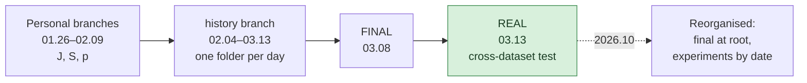

# Repository Guide

[← README](../README.md) · **English** | [한국어](repository_ko.md)

## Folder Tree

```text
CAN_IDS/
├── README.md / README_ko.md       Project overview (English / Korean)
├── docs/                          Post-mortem, timeline, this guide
├── requirements.txt
│
├── encoding/                      [final] Feature encoding, 13 channels, window 128 / stride 64
│   ├── car_challenge_encoding.ipynb   Car Hacking Challenge 2021 → carchallenge_training_0313.npz
│   └── carhacking_encoding.ipynb      Car-Hacking Dataset → carhacking_0313.npz
│
├── scaling/                       [final]
│   └── robust_scaling.ipynb           median / IQR from train, clip ±5, map to [0, 1] → *_robust_0313.npz
│
├── model/                         [final]
│   ├── Multi_TCN.ipynb                2-stage TCN training + cross-dataset evaluation
│   └── weights/TCN{1,2}_0313_all.pth
│
├── experiments/                   [experiment] Everything tried before, one folder per date
│   ├── README.md                      What each folder tried, source branch, renamed files
│   ├── 2026-01-26_mirgu_xai/ … 2026-02-03_tcn_5ch_multicnn/   January CNN / early TCN (main, J, S, p)
│   ├── 2026-02-04_… … 2026-02-26_…/                           February feature search (history)
│   └── 2026-03-05_… … 2026-03-13_…/                           March scaling, FINAL, importance (history)
│
└── data/                          MIRGU window tables from the first experiments
    ├── README.md
    └── mirgu/{dos,fuzzing}/*.zip
```

`[final]` the pipeline behind the reported result · `[experiment]` kept for reference, not needed to reproduce it

## Workflow



During the project, files were shared by uploading notebooks through the GitHub web UI into per-day folders. Folders were created with placeholder files (`a`, `h`, `d`, `ㅅ`), and versions were told apart by suffixes (`_0211_1202`, `찐최종`, `REAL`). In 2026.10 the repository was reorganised: the final pipeline moved to the root, every earlier version moved to `experiments/` by date, placeholders and byte-identical copies were dropped, and the copied files were checked byte-for-byte against the original branches.

## Branches and Tags

| Name | Contents |
|---|---|
| `main` | This layout |
| `history` | Original per-day folders (`0130/` … `0313/`), unchanged |
| `J` | Original January–February CNN / TCN notebooks, unchanged |
| `S` | Original 01.30 CNN-dropout notebooks (other files deleted on that branch; do not merge) |
| `final-2026-03-13` (tag) | `history` at the 03.13 upload of `0313/REAL/` |

Branches `p` and `kha-2-patch-1` were deleted after their files were copied into `experiments/`.

## Datasets

| Dataset | Used for | In this repository |
|---|---|---|
| Car Hacking Challenge 2021 (`0_Preliminary/1_Submission`, `0_Training`) | Training; held-out tests in some experiments | No |
| Car-Hacking Dataset (DoS, Fuzzy, gear, RPM, normal) | Final cross-dataset test | No |
| Audi CAN data | Cross-dataset test in 02.26–03.08 experiments | No |
| MIRGU | First experiments (01.26–01.30) | `data/mirgu/` (window tables) |

Labels: 0 Normal, 1 DoS (Flooding), 2 Fuzzing, 3 Replay, 4 Spoofing (gear / RPM in the Car-Hacking Dataset).
