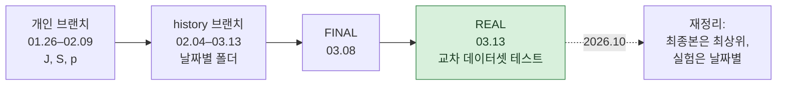

# 레포 안내

[← README](../README_ko.md) · [English](repository.md) | **한국어**

## 폴더 구조

```text
CAN_IDS/
├── README.md / README_ko.md       프로젝트 소개 (영어 / 한국어)
├── docs/                          회고, 타임라인, 이 문서
├── requirements.txt
│
├── encoding/                      [최종] 피처 인코딩, 13채널, window 128 / stride 64
│   ├── car_challenge_encoding.ipynb   Car Hacking Challenge 2021 → carchallenge_training_0313.npz
│   └── carhacking_encoding.ipynb      Car-Hacking Dataset → carhacking_0313.npz
│
├── scaling/                       [최종]
│   └── robust_scaling.ipynb           학습 데이터 median / IQR, ±5 clip, [0, 1] 변환 → *_robust_0313.npz
│
├── model/                         [최종]
│   ├── Multi_TCN.ipynb                2단계 TCN 학습 + 교차 데이터셋 평가
│   └── weights/TCN{1,2}_0313_all.pth
│
├── experiments/                   [실험] 이전에 시도한 모든 것, 날짜별 폴더
│   ├── README.md                      폴더별 내용, 출처 브랜치, 이름 바꾼 파일
│   ├── 2026-01-26_mirgu_xai/ … 2026-02-03_tcn_5ch_multicnn/   1월 CNN / 초기 TCN (main, J, S, p)
│   ├── 2026-02-04_… … 2026-02-26_…/                           2월 피처 탐색 (history)
│   └── 2026-03-05_… … 2026-03-13_…/                           3월 스케일링, FINAL, 중요도 (history)
│
└── data/                          초기 실험의 MIRGU 윈도우 테이블
    ├── README.md
    └── mirgu/{dos,fuzzing}/*.zip
```

`[최종]` 보고한 결과를 만든 파이프라인 · `[실험]` 참고용, 결과 재현에는 필요 없음

## 작업 방식



프로젝트 기간에는 GitHub 웹 UI로 노트북을 날짜별 폴더에 업로드해서 공유했습니다. 폴더는 placeholder 파일(`a`, `h`, `d`, `ㅅ`)로 만들었고, 버전은 접미사(`_0211_1202`, `찐최종`, `REAL`)로 구분했습니다. 2026.10에 레포를 재정리했습니다. 최종 파이프라인은 최상위로, 이전 버전은 모두 `experiments/`에 날짜별로 옮겼고, placeholder와 내용이 같은 사본은 제외했으며, 옮긴 파일은 원본 브랜치와 바이트 단위로 대조했습니다.

## 브랜치와 태그

| 이름 | 내용 |
|---|---|
| `main` | 현재 구조 |
| `history` | 원래 날짜별 폴더(`0130/` … `0313/`), 변경 없음 |
| `J` | 1–2월 CNN / TCN 원본 노트북, 변경 없음 |
| `S` | 01.30 CNN-dropout 원본 노트북 (이 브랜치에서 다른 파일은 삭제됨, 병합 금지) |
| `final-2026-03-13` (태그) | `0313/REAL/`을 올린 03.13 시점의 `history` |

`p`와 `kha-2-patch-1` 브랜치는 파일을 `experiments/`로 옮긴 뒤 삭제했습니다.

## 데이터셋

| 데이터셋 | 용도 | 레포 포함 |
|---|---|---|
| Car Hacking Challenge 2021 (`0_Preliminary/1_Submission`, `0_Training`) | 학습, 일부 실험의 별도 테스트 | 아니요 |
| Car-Hacking Dataset (DoS, Fuzzy, gear, RPM, normal) | 최종 교차 데이터셋 테스트 | 아니요 |
| Audi CAN 데이터 | 02.26–03.08 실험의 교차 테스트 | 아니요 |
| MIRGU | 초기 실험 (01.26–01.30) | `data/mirgu/` (윈도우 테이블) |

라벨: 0 Normal, 1 DoS (Flooding), 2 Fuzzing, 3 Replay, 4 Spoofing (Car-Hacking Dataset에서는 gear / RPM).
