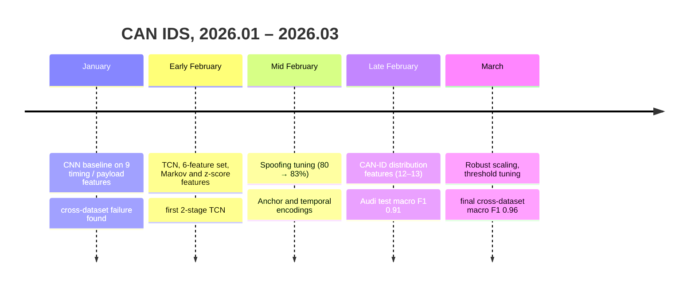

# Timeline

[← README](../README.md) · **English** | [한국어](timeline_ko.md)

Dates come from commits and folder names. Numbers are the outputs stored in each notebook.
Unless noted, training data is Car Hacking Challenge 2021 (`1_Submission`) and "cross" means the Car-Hacking Dataset.
Per-class numbers are packet-level accuracy (recall) unless marked F1.

## January — CNN Baseline

| Date | Folder | What changed | Result |
|---|---|---|---|
| 01.26 | `2026-01-26_mirgu_xai` | Attention + CNN on MIRGU windows, attention weights as explanation | Test macro F1 0.999 on a random split (overlapping windows, likely optimistic); XAI cell errored |
| 01.29 | `2026-01-29_cnn_baseline` | 9 features (Global IAT, ID IAT, entropy, Hamming, DLC, delta, jitter, byte mean / std), window 64 / stride 32, causal CNN | Cross: macro F1 0.71 (window-level); re-evaluated last-step accuracy 67.8% |
| 01.30 | `2026-01-30_cnn_dropout` | BatchNorm + dropout, attack oversampling in encoding | Validation macro F1 0.81–0.82 (Replay F1 0.27); cross Spoofing 11.1% |

## February — TCN and Feature Search

| Date | Folder | What changed | Result |
|---|---|---|---|
| 02.02 | `2026-02-02_cnn_attention_tcn` | CNN + dual-stage attention, first TCN, 5-channel TCN | Validation macro F1 0.87; cross macro F1 0.31–0.50, Spoofing 1–6% |
| 02.03 | `2026-02-03_tcn_5ch_multicnn` | 5 features, TCN [32, 64, 128], Replay masked from loss, first 2-stage CNN draft | Cross macro F1 0.50 (Fuzzing 13.6%, Spoofing 5.0%) |
| 02.04 | `2026-02-04_6feat_tcn_multicnn` | 6 features (ID IAT, ID 0x000 flag, entropy, complexity, Hamming rate, frequency) | Validation macro F1 0.89; cross Normal 42.8% |
| 02.09 | `2026-02-09_markov_zscore_dualtcn` | Markov transition score, entropy / payload z-score, new 9-feature set, first Dual TCN | Dual TCN cross: Normal 54.9 / Fuzzing 7.8 / Spoofing 88.2% |
| 02.10 | `2026-02-10_162feat_dualtcn` | TCN channels [32, 64, 128], DoS / Fuzzing thresholds; 162 candidate features → 30 | Normal 53.8 / DoS 100 / Fuzzing 93.0 / Spoofing 88.2% |
| 02.11 | `2026-02-11_spoofing_tuning` | 2-stage layout fixed (TCN1 Normal/DoS/Fuzzing, TCN2 Normal/Spoofing); 15 features, window 128 | Spoofing 80.6% → 83.2%; window 128: Normal 98.9 / DoS 100 / Fuzzing 98.8 / Spoofing 90.9% |
| 02.12 | `2026-02-12_anchor_temporal` | Anchor IAT, temporal encoding, 12-feature variant | "Spoofing 97%" tested on training-source data; on held-out `0_Training_test` Spoofing 3.7% |
| 02.23 | `2026-02-23_basic13feat` | Redesigned 13 features (ID 0x000, DLC, continuity, local frequency, ID entropy, streak, top-1 share, dominance …), window 256 | Cross: Normal 33.4 / DoS 100 / Fuzzing 84.6 / Spoofing 94.1% |
| 02.24 | `2026-02-24_stage2_feat` | Stage-2 feature selection, window 128 | Encoding only |
| 02.26 | `2026-02-26_12feat_audi` | 12 features, Stage 2 on local frequency + frequency vs top-1 | Audi: accuracy 0.967, macro F1 0.914 |

## March — Scaling and Final

| Date | Folder | What changed | Result |
|---|---|---|---|
| 03.05 | `2026-03-05_robust_scaling` | Robust scaling (train median / IQR), train vs test distribution check | Audi macro F1 0.899; Car-Hacking per class 97.6 / 100 / 94.9 / 93.4% |
| 03.08 | `2026-03-08_threshold_tuning` | Fuzzing threshold sweep (0.1–0.9), dropout 0.2 / 0.5 | Cross macro F1 0.924–0.932 |
| 03.08 | `2026-03-08_threshold_tuning/FINAL` | 13th feature (same-ID payload surprise), Stage 1 on 7 channels | Tested on Challenge `0_Training_test`: accuracy 0.979, Spoofing 32.8%, Replay 0% |
| 03.13 | root (`encoding/`, `scaling/`, `model/`) | Same code as FINAL, test switched to the Car-Hacking Dataset | **Cross: accuracy 0.9793, macro F1 0.9605** |
| 03.13 | `2026-03-13_real_crossdataset` | Permutation importance; single-TCN comparison | Fuzzing relies on surprise (ch 12) and ID entropy (ch 5); DoS on ID 0x000 (ch 0); Spoofing on local frequency (ch 4). Single TCN Spoofing 11.8% |
