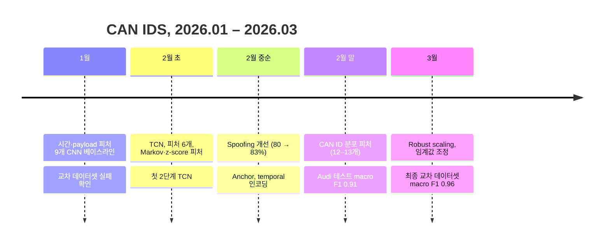

# 타임라인

[← README](../README_ko.md) · [English](timeline.md) | **한국어**

날짜는 커밋과 폴더 이름 기준이고, 수치는 각 노트북에 저장된 출력입니다.
따로 적지 않으면 학습 데이터는 Car Hacking Challenge 2021(`1_Submission`), "교차"는 Car-Hacking Dataset 테스트입니다.
클래스별 수치는 F1이라고 적지 않은 한 패킷 단위 정확도(recall)입니다.

## 1월 — CNN 베이스라인

| 날짜 | 폴더 | 변경 내용 | 결과 |
|---|---|---|---|
| 01.26 | `2026-01-26_mirgu_xai` | MIRGU 윈도우에 Attention + CNN, attention 가중치로 설명 | 무작위 split 테스트 macro F1 0.999 (윈도우 겹침으로 과대평가 가능), XAI 셀 에러 |
| 01.29 | `2026-01-29_cnn_baseline` | 피처 9개(Global IAT, ID IAT, 엔트로피, Hamming, DLC, delta, jitter, byte 평균·표준편차), window 64 / stride 32, causal CNN | 교차: macro F1 0.71 (윈도우 단위), 마지막 스텝 기준 재평가 정확도 67.8% |
| 01.30 | `2026-01-30_cnn_dropout` | BatchNorm + dropout, 인코딩 단계 공격 오버샘플링 | 검증 macro F1 0.81–0.82 (Replay F1 0.27), 교차 Spoofing 11.1% |

## 2월 — TCN과 피처 탐색

| 날짜 | 폴더 | 변경 내용 | 결과 |
|---|---|---|---|
| 02.02 | `2026-02-02_cnn_attention_tcn` | CNN + dual-stage attention, 첫 TCN, 5채널 TCN | 검증 macro F1 0.87, 교차 macro F1 0.31–0.50, Spoofing 1–6% |
| 02.03 | `2026-02-03_tcn_5ch_multicnn` | 피처 5개, TCN [32, 64, 128], Replay loss 제외, 2단계 CNN 초안 | 교차 macro F1 0.50 (Fuzzing 13.6%, Spoofing 5.0%) |
| 02.04 | `2026-02-04_6feat_tcn_multicnn` | 피처 6개(ID IAT, ID 0x000 여부, 엔트로피, complexity, Hamming rate, 빈도) | 검증 macro F1 0.89, 교차 Normal 42.8% |
| 02.09 | `2026-02-09_markov_zscore_dualtcn` | Markov 전이 점수, 엔트로피·payload z-score, 새 9피처 세트, 첫 Dual TCN | Dual TCN 교차: Normal 54.9 / Fuzzing 7.8 / Spoofing 88.2% |
| 02.10 | `2026-02-10_162feat_dualtcn` | TCN 채널 [32, 64, 128], DoS·Fuzzing 임계값, 피처 후보 162개 → 30개 | Normal 53.8 / DoS 100 / Fuzzing 93.0 / Spoofing 88.2% |
| 02.11 | `2026-02-11_spoofing_tuning` | 2단계 구조 확정(TCN1 Normal/DoS/Fuzzing, TCN2 Normal/Spoofing), 피처 15개·window 128 | Spoofing 80.6% → 83.2%, window 128: Normal 98.9 / DoS 100 / Fuzzing 98.8 / Spoofing 90.9% |
| 02.12 | `2026-02-12_anchor_temporal` | Anchor IAT, temporal 인코딩, 12피처 변형 | "Spoofing 97%"는 학습과 같은 출처로 테스트, 별도 `0_Training_test`에서는 Spoofing 3.7% |
| 02.23 | `2026-02-23_basic13feat` | 피처 13개 재설계(ID 0x000, DLC, continuity, 국소 빈도, ID 엔트로피, streak, top-1 비율, 지배도 등), window 256 | 교차: Normal 33.4 / DoS 100 / Fuzzing 84.6 / Spoofing 94.1% |
| 02.24 | `2026-02-24_stage2_feat` | Stage 2 피처 선택, window 128 | 인코딩만 |
| 02.26 | `2026-02-26_12feat_audi` | 피처 12개, Stage 2는 국소 빈도 + top-1 대비 빈도 | Audi: accuracy 0.967, macro F1 0.914 |

## 3월 — 스케일링과 최종

| 날짜 | 폴더 | 변경 내용 | 결과 |
|---|---|---|---|
| 03.05 | `2026-03-05_robust_scaling` | Robust scaling(학습 median / IQR), 학습·테스트 분포 비교 | Audi macro F1 0.899, Car-Hacking 클래스별 97.6 / 100 / 94.9 / 93.4% |
| 03.08 | `2026-03-08_threshold_tuning` | Fuzzing 임계값 0.1–0.9 탐색, dropout 0.2 / 0.5 | 교차 macro F1 0.924–0.932 |
| 03.08 | `2026-03-08_threshold_tuning/FINAL` | 13번째 피처(같은 ID payload surprise), Stage 1 7채널 | Challenge `0_Training_test` 테스트: accuracy 0.979, Spoofing 32.8%, Replay 0% |
| 03.13 | 최상위 (`encoding/`, `scaling/`, `model/`) | FINAL과 같은 코드, 테스트를 Car-Hacking Dataset으로 변경 | **교차: accuracy 0.9793, macro F1 0.9605** |
| 03.13 | `2026-03-13_real_crossdataset` | Permutation 중요도, 단일 TCN 비교 | Fuzzing은 surprise(ch 12)·ID 엔트로피(ch 5), DoS는 ID 0x000(ch 0), Spoofing은 국소 빈도(ch 4)에 의존. 단일 TCN Spoofing 11.8% |
